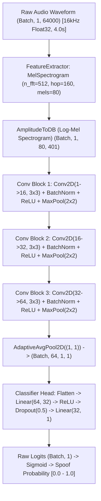

# V-SHIELD — PHASE 2 TECHNICAL & ML AUDIT

**Audit Date:** September 15, 2026  
**Auditor:** Senior ML & Audio Systems Engineer  
**Status:** **PHASE 1 COMPLETE — PROCEEDING TO PHASE 2 PIPELINE IMPLEMENTATION**

---

## 1. Current Model Architecture

The V-SHIELD anti-spoofing subsystem currently utilizes `LightweightAntiSpoofCNN` defined in `ml/src/model.py`.

### Key Architectural Parameters
- **Feature Extractor:** Integrated directly into the model graph (`torchaudio.transforms.MelSpectrogram` + `AmplitudeToDB`).
- **Sampling Rate:** 16,000 Hz.
- **FFT Parameters:** `n_fft = 512`, `hop_length = 160` (10ms frame rate), `n_mels = 80`.
- **Backbone:** 3-stage 2D Convolutional network with Batch Normalization.
- **Temporal Invariance:** Global Average Pooling (`AdaptiveAvgPool2d((1, 1))`), enabling variable-length audio input while preserving fixed representation size.
- **Output:** Scalar logit trained via `torch.nn.BCEWithLogitsLoss`.

---

## 2. Current Model Input / Output & Runtime Contract

The inference runtime contract is governed by `backend/app/audio/protocol.py` and `backend/app/ml/model.py`:

| Parameter | Value | Details |
| :--- | :--- | :--- |
| **Acoustic Sample Rate** | 16,000 Hz | Single source of truth across frontend, backend, and training. |
| **Channels** | 1 (Mono) | Multi-channel audio is averaged to mono. |
| **Data Type** | `float32` | Standard normalized float ranging between -1.0 and 1.0. |
| **Window Length** | 64,000 samples | 4.0 seconds fixed analysis duration. |
| **Hop Size** | 16,000 samples | 1.0 second evaluation interval. |
| **Inference Tensor Shape** | `(Batch, 1, 64000)` | 3D tensor representing `(Batch, Channel, Time)`. |
| **Model Output** | `(Batch, 1)` | Float logit transformed to probability via `torch.sigmoid()`. |
| **Label Convention** | `0 = BONAFIDE, 1 = SPOOF` | Higher probability denotes higher likelihood of synthetic speech. |

---

## 3. Current Preprocessing Analysis

In `backend/app/ml/model.py`:
- **Length Normalization:** If waveform length $< 64,000$ samples, zero-pad on the right: `torch.nn.functional.pad(waveform, (0, padding))`. If $> 64,000$, slice first 64,000 samples: `waveform[:, :64000]`.
- **Peak Amplitude Normalization:** `waveform = waveform / torch.max(torch.abs(waveform))` if maximum absolute value $> 0$.

### Preprocessing Consistency Requirement
The training pipeline **must strictly replicate** this exact preprocessing chain:
1. Resample to 16,000 Hz.
2. Convert multi-channel audio to mono (channel averaging).
3. Validate finite numbers (zero out or discard `NaN`/`Inf`).
4. Apply peak normalization (`abs_max`).
5. Window/pad to exactly 64,000 samples (4.0 seconds).

---

## 4. Checkpoint Format & Metadata

- **Current Checkpoint:** `models/vshield_antispoof_v1/best_model.pt`
- **Origin:** Generated by `generate_model.py` with random uncalibrated tensor weights.
- **Current Metadata:** `models/vshield_antispoof_v1/model_meta.json`
  - `status: "UNTRAINED"`
  - `production_ready: false`
  - `validation_status: "DEVELOPMENT_ONLY"`
  - `disclaimer: "Anti-spoofing model is not validated for production use."`

---

## 5. Training Gaps & Deficiencies

1. **No Dataset Abstraction:** The repository lacks dataset loading adapters for standard voice anti-spoofing benchmarks (ASVspoof 2019 LA, ASVspoof 2021 LA/DF, In-The-Wild).
2. **Missing Dataset Manifests:** No unified CSV metadata structure exists with label standardization, duration, and speaker mappings.
3. **No Speaker Leakage Prevention:** No mechanism exists to guarantee that training, validation, and test splits have completely disjoint speaker sets.
4. **No Training Pipeline:** `training/src/train.py` was a 29-byte empty placeholder.
5. **No Evaluation Metrics:** No implementation of Equal Error Rate (EER), min-tDCF, or ROC-AUC calculations exists in the training module.
6. **No Cloud GPU Training Workflow:** No self-contained Kaggle / Google Colab notebooks configured to train on GPU and export compliant checkpoints.

---

## 6. Hardware Constraints & Execution Strategy

- **Local Machine Profile:** AMD Ryzen 5 5500U CPU, 8 GB RAM, Integrated Radeon Graphics, Windows, CPU-only PyTorch.
- **Safety Directive:**
  - Do NOT download 20+ GB datasets locally.
  - Do NOT train large models locally (avoids RAM thrashing and system unresponsiveness).
  - Use local environment exclusively for:
    1. Pipeline architecture & code development.
    2. Manifest parsing & validation testing.
    3. Small deterministic smoke tests (tiny synthetic audio batches).
    4. Integration verification with existing Phase 1 WebSocket runtime.
- **Model Training Target:**
  - Kaggle GPU (NVIDIA T4 x2 or P100) or Google Colab GPU (T4 / A100).
  - Produce self-contained Jupyter notebook (`training/notebooks/kaggle_training.ipynb`) enabling one-click reproduction in the cloud.

---

## 7. Recommended Training Architecture

1. **Dataset Adapters (`training/datasets/`):**
   - Base abstract adapter interface with dataset auto-discovery.
   - Concrete adapters for ASVspoof 2019 (Logical Access), ASVspoof 2021 (LA/DF), and In-The-Wild.
2. **Standardized Manifest (`training/data/metadata/`):**
   - Columns: `file_path`, `speaker_id`, `label` (0=bonafide, 1=spoof), `attack_type`, `dataset`, `split`, `sample_rate`, `duration`, `num_samples`.
3. **Speaker-Safe Splitter:**
   - Evaluates disjoint speaker sets: $\text{Speakers}_{\text{train}} \cap \text{Speakers}_{\text{val}} = \emptyset$ and $\text{Speakers}_{\text{train}} \cap \text{Speakers}_{\text{test}} = \emptyset$.
4. **PyTorch Lazy Dataset & Streaming DataLoader:**
   - Reads audio files on-demand using `soundfile` / `torchaudio`.
   - Never loads full dataset into memory.
5. **Evaluation Suite:**
   - Calculate False Alarm Rate (FAR), False Rejection Rate (FRR), Equal Error Rate (EER), ROC-AUC, and F1 score.
   - Calibrate optimal decision threshold on validation set; apply threshold to test set.
6. **Checkpoint Exporter:**
   - Saves clean PyTorch `state_dict`.
   - Generates compliant `model_meta.json` with authentic training metrics.
