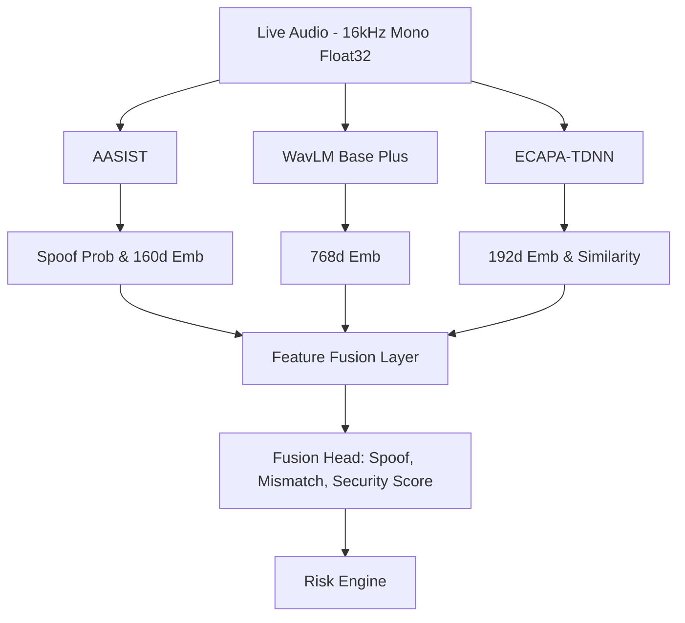

# V-SHIELD — PHASE 3 MULTI-MODEL ARCHITECTURE

## 1. Rationale

The transition from a single LightweightAntiSpoofCNN to a Multi-Model architecture was initiated to improve generalization against unseen vocoders and zero-shot voice conversion algorithms.

### AASIST
**Role:** Primary Anti-Spoofing Detection
**Why:** AASIST (Audio Anti-Spoofing using Integrated Spectro-Temporal Graph Attention Networks) is the state-of-the-art on ASVspoof 2019. It uses a graph-attention mechanism over a RawNet2 encoder to effectively capture heterogeneous artifacts in spoofed speech.

### WavLM
**Role:** Robust Pre-trained Speech Representation
**Why:** WavLM is a powerful Self-Supervised Learning (SSL) model for speech processing. It excels at extracting rich acoustic representations that are robust to noise and compression, providing a strong baseline feature set that can be fine-tuned.

### ECAPA-TDNN
**Role:** Speaker Verification
**Why:** ECAPA-TDNN focuses on speaker biometrics. By verifying whether the acoustic identity matches the enrolled user, it adds a second layer of defense (preventing impersonation attacks where the voice is real but belongs to someone else).

## 2. Architecture & Data Flow

## 3. Runtime Contract & Model Loading

- **Audio Contract:** All models receive a normalized, sanitized 4.0-second 16kHz mono audio tensor `(1, 1, 64000)`.
- **Model Managers:** Each model is wrapped in a `<Model>Loader` class that handles instantiation, weight loading, and fallback.
- **Lazy Singleton:** Models are initialized exactly once at application startup in `main.py` via `multimodel_instance.load_models()`.
- **Model Status:** If a checkpoint is missing, the status degrades to `UNTRAINED_FOR_VSHIELD` or `MODEL_NOT_AVAILABLE` rather than synthesizing fake predictions.

## 4. Training Plan

The fusion network is defined but **untrained**. In Phase 4, we will execute a Kaggle-based GPU training loop that:
1. Freezes AASIST and WavLM parameters initially.
2. Trains the `FeatureFusion` and `MultiModelFusionHead` to optimally map concatenated embeddings to `[spoof, speaker_mismatch, combined_security]`.
3. Validates against the ASVspoof 2019 dataset using the pre-existing evaluation pipeline.

## 5. Limitations

- **Hardware Memory Limits:** WavLM is memory-intensive. For edge deployments or constrained laptops, the `wavlm_enabled` flag in `ml/config/multimodel.yaml` should be `false`.
- **Latency:** Executing three large models sequentially increases latency. Production environments will require batching or GPU acceleration to stay under the 100ms real-time threshold.
